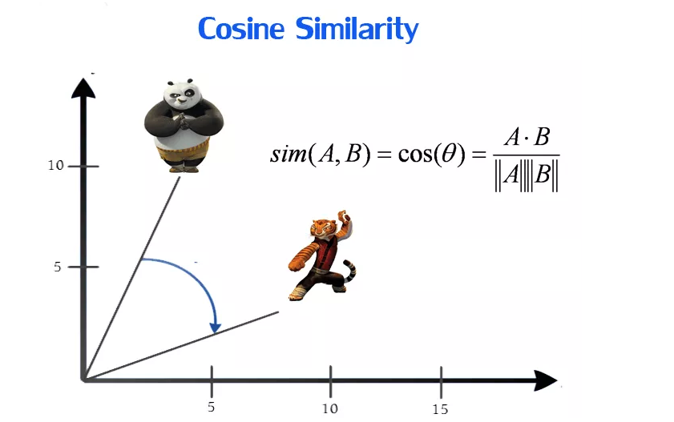

# Movies Recommendation System

<a href="https://iaexpert.academy/2017/03/17/o-que-sao-sistemas-de-recomendacao">Fonte da imagem</a>

Tecnologias:

    
## 📃 Descrição do projeto
Nete projeto foi desenvolvido uma aplicação web para fazer a recomendação de filmes, baseado no conteúdo e preferências do usuário.

### Sistemas de recomendação

O objetivo dos sistemas de recomendação é melhorar a experiência do usuário, recomendando produtos que podem ser melhores e mais interessantes para o consumidor final.

Os produtos recomendados automaticamente para os usuários, são sugeridos através de critérios que utilizam as informações e os dados de consumo (Big Data) de cada indivíduo.

Um sistema de recomendação também pode ser utilizado como Sales Force na atualização do CRM (Customer Relationship Management), cujo objetivo é reter clientes, estabelecendo a melhor relação possível entre Empresa e o Cliente.

* **Exemplos de sistema de recomendação:**
  * Youtube - Recomenda videos com base no conteúdo assistido.
  * Spotify - Recomenda músicas e cria playlists personalizadas.
  * Amazon - Divulga e recomenda novos produtos de acordo com o histórico de compras do usuário.

## Visão geral do projeto

<a href="https://coralogix.com/blog/heroku-logs-the-complete-guide/">Fonte da imagem</a>

- Data Mining (extração) com **SQL Server**
- Manipulação e transformação dos dados com **Python** e **Jupyter Notebook**
- Criação do modelo de **Machine Learning**
- Criação do Data WebApp com **Flask** e **Heroku**

### Dados da fonte

* **Banco de dados tmdb**:
  * [Tabela movies - filmes](https://grouplens.org/datasets/movielens/25m)
  * [Tabela ratings - avaliações](https://grouplens.org/datasets/movielens/25m)

## Machine Learning

Neste projeto o modelo de Machine Learning usado foi o **K - Nearest Neighbors Classifier (KNN)**. O KNN faz recomendações, com base na similaridade entre dos usuários.

### Similaridade de cosseno

A similaridade de cosseno é utilizada para definir a similaridade entre dois pontos de dados. Matematicamente, a similaridade mede o cosseno do ângulo entre dois vetores em um espaço multidimensional.
Neste projeto essa métrica foi utilizada para identificar os usuários mais similares, considerando a nota de avaliação dada por cada um para um mesmo título de filme.

## Aplicativo - Web DataApp

Durante o desenvolvimento do projeto, foi desenvolvida uma aplicação que recomenda 5 filmes, após o usuário selecionar um título e dar uma nota de avaliação.